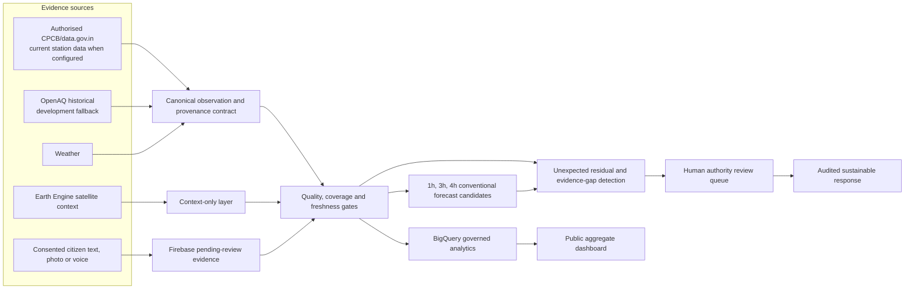
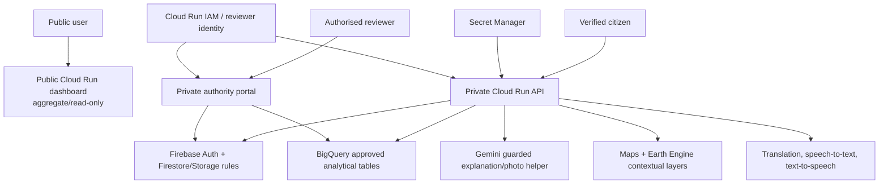

# AirSentinel system architecture

## System introduction

AirSentinel is a locality-first evidence and early-warning platform. It addresses the gap between city-wide monitoring and the ward, village-edge, industrial-zone or transport-corridor decision that a public authority actually needs to investigate.

Its core response to an unexpected event is deliberately conservative:

```text
detect a mismatch -> preserve evidence -> mark cause unverified -> request corroboration -> human review -> record an auditable action
```

## Logical architecture



## Google Cloud target



The public dashboard may be unauthenticated only because it exposes reviewed aggregate artifacts. The API and authority portal remain private. Firebase client rules deny direct writes by default; server-side access uses least-privilege Application Default Credentials.

## Model policy

- Use persistence as the first baseline.
- Compare an established conventional tree-boosting candidate on the same chronological hold-out.
- Use empirical uncertainty and publish the hold-out dates.
- No model output is official AQI or a live alert until approved operational validation exists.
- Do not promote deep learning or federated learning in the submission.
- Vertex AI is an optional managed host for a human-approved conventional model, not proof that the model is good.
