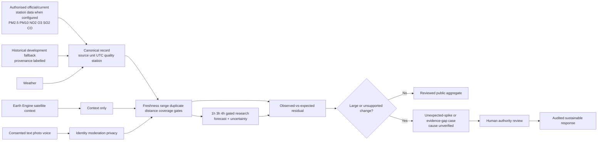
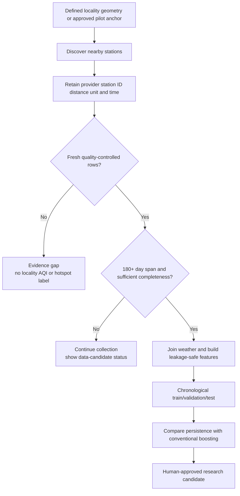
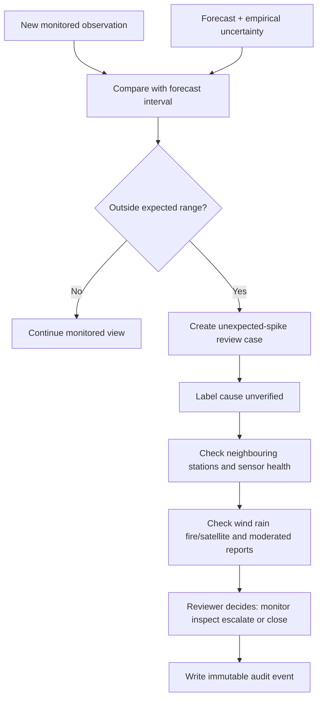
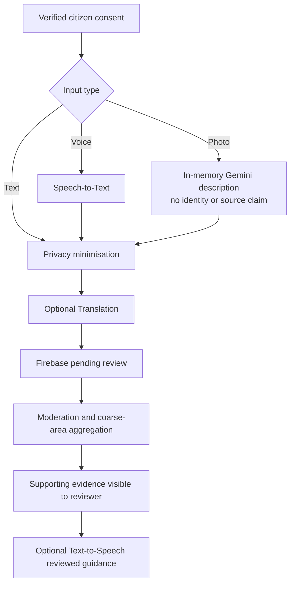
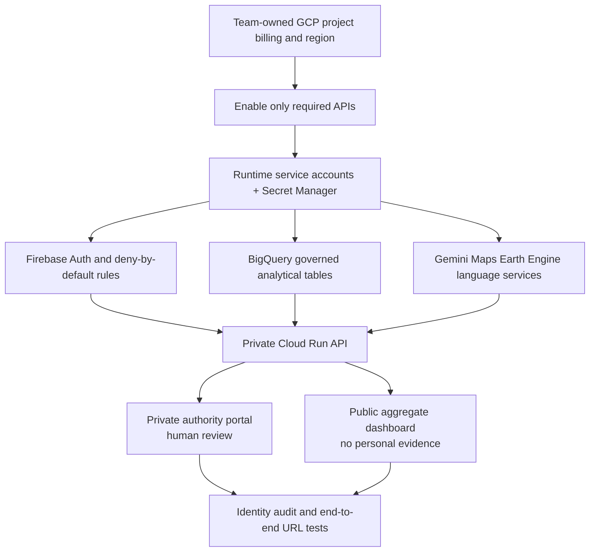

# AirSentinel workflow diagrams

These are the submission-ready flows. Contextual evidence never proves a pollution source, and automated logic never performs enforcement.

## 1. Complete evidence-to-action workflow

## 2. Locality evidence gate

## 3. Sudden spike and forecast-failure safeguard

## 4. Citizen multimodal and accessibility flow

## 5. Google Cloud deployment flow

## Non-negotiable interpretation rules

1. A nearby station is a locality proxy unless a monitor is physically verified inside the approved geometry.
2. CPCB/data.gov.in is the preferred official Indian current source; a fallback must remain visibly labelled.
3. Satellite, weather, a photo, a purifier or one citizen report cannot independently prove source or responsibility.
4. Forecasts are estimates with intervals; a sudden miss creates a review case rather than a confident explanation.
5. Authority actions require identity and are audited. No endpoint automatically publishes an alert, attributes a source or enforces a measure.
